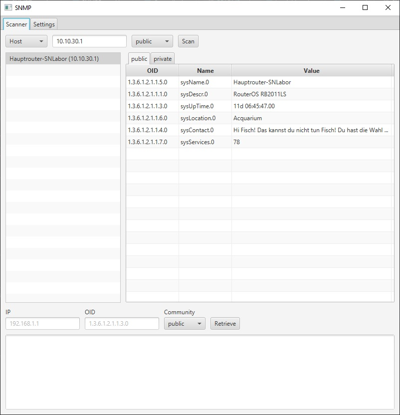
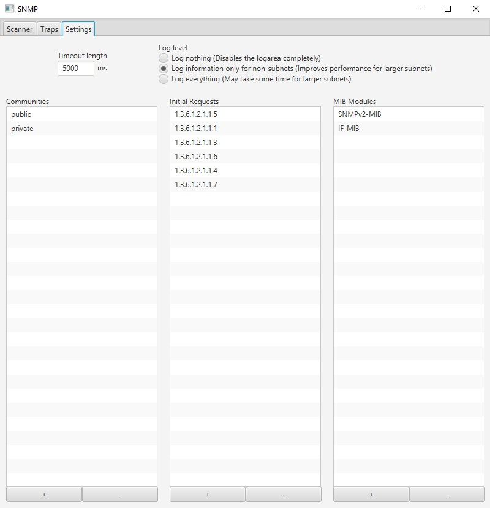

# SNMP
A simple SNMP-Scanner based on the tnm4j-library.
To run the scanner on your computer, download the executable jar file from the latest release and run the following 
command in the folder, where you downloaded it: ```java -jar [JAR-NAME]```.  
The jar has to be executed using Java 8. To verify whether you are running Java 8, run the command ```java -version```. 
The first line of the output should look similar to this: ```java version "1.8.0_181"```.  
Alternatively, you can build the project yourself, you will need to have JDK 1.8.0 installed though. For additional 
instructions refer to the section [Build the project yourself](#build-the-project-yourself).

## User Interface
A picture of the main UI after a single request to the IP-Address 10.10.30.1:


A picture of the settings-tab where initially polled OIDs, communities and used MIB-modules can be modified.


## Project Status
This project is still a work-in-progress.
### What already works
* Scan single IP-Addresses for six different OIDs in two Communities out of the box.
* Scan not only using OIDs, but also MIB names.
* Support for two MIB-modules.
* View OID, name and value of every previously performed request on every IP-Address in a nicely formatted table.
* Be informed of timed-out requests, complete with additional information on which request timed out.
* Ability to customize which OIDs to poll.
* Ability to customize which communities to use.
* Ability to customize which MIB-modules to use.

### What is still to come
* Poll entire subnets at once, specified with a mask.
* Poll entire ranges at once, specified by a start- and an end-Address.
* Flexibly poll a single OID on a single IP-Address using a single community.
* Receive Traps and Informs

## Build the project yourself
To build the Scanner on your own, import the project into your favourite IDE.
For this example, I will use IntelliJ IDEA (Community Version). The Community Version can be downloaded for free from [here](https://www.jetbrains.com/idea/download).
1. Open IntelliJ IDEA.
2. Navigate to File > New > Project from Version Control... > Git  
Here enter the following link: https://github.com/Maximilian-Mitterrutzner/SNMP.git and confirm with "Clone".
3. Now Right-Click on the Projekt Name and navigate to "Add Frameworks Support..." and select the checkBox with Maven. Confirm with OK.
4. Under Project Structure > Project Settings > Project > Project SDK select "1.8.0_181" and set the project language level to "SDK default".
5. In the last step go to Add Configuration... > + > Application and select "com.mitmax.Main" as the Main class.  
Optionally you can set the name to Main too. Confirm with OK.
6. That's it. Now just press on the green Play button, and the application should start.