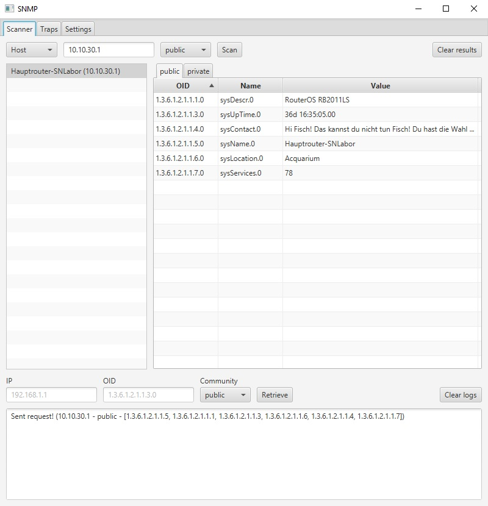

# SNMP
A simple SNMP-Scanner based on the tnm4j-library.
To run the scanner on your computer, download the executable jar file from the latest release and run the following 
command in the folder, where you downloaded it: ```java -jar [JAR-NAME]```.  
The jar has to be executed using Java 8. To verify whether you are running Java 8, run the command ```java -version```. 
The first line of the output should look similar to this: ```java version "1.8.0_181"```.  
Alternatively, you can build the project yourself, you will need to have JDK 1.8.0 installed though. For additional 
instructions refer to the section [Build the project yourself](#build-the-project-yourself).

## Build the project yourself
To build the Scanner on your own, import the project into your favourite IDE.
For this example, I will use IntelliJ IDEA (Community Version). The Community Version can be downloaded for free from [here](https://www.jetbrains.com/idea/download).
1. Open IntelliJ IDEA.
2. Navigate to File > New > Project from Version Control... > Git  
   Here enter the following link: https://github.com/Maximilian-Mitterrutzner/SNMP.git and confirm with "Clone".
3. Now Right-Click on the project Name and navigate to "Add Frameworks Support..." and select the checkBox with Maven. Confirm with OK.
4. Under Project Structure > Project Settings > Project > Project SDK select "1.8.0_181" and set the project language level to "SDK default".
5. In the last step go to Add Configuration... > + > Application and select "com.mitmax.Main" as the Main class.  
   Optionally you can set the name to Main too. Confirm with OK.
6. That's it. Now just press on the green Play button, and the application should start.

## User Interface
The main UI looks like this after performing a single request to the IP-Address 10.10.30.1:


Not only can you poll single Hosts, but also entire subnets, specified by a mask:


Still not specific enough? How about an address range?


You can also receive and view both informs and traps, this is what it looks like after receiving one:


This is the settings-tab, where timeout, log-level, initially polled OIDs, communities and used MIB-modules can be modified.


## Functionality
* Scan single IP-addresses, subnets and address-ranges with an array of six different OIDs out of the box.
* Poll individual IP-addresses with individual OIDs.
* Scan not only using OIDs, but also MIB names.
* Two MIB-modules are loaded by default, with the ability to load as many others as you want.
* View OID, name and value of every previously performed request on every IP-Address in a nicely formatted table.
* Display the hostname of hosts without having to search it in the results.
* Be informed of timed-out requests, complete with additional information on which request timed out.
* Receive and view both traps and informs.
* Settings are saved and reloaded automatically.
* Customize a wide variety of things:
  * Timeouts for requests.
  * Log-level. 
  * Which OIDs to poll.
  * Which communities to use.
  * Which MIB-modules to use.

## Project Status
This project is pretty much finished. At best there might be a few bug-fixes and maybe a feature or two if someone were to request them, but that's all.